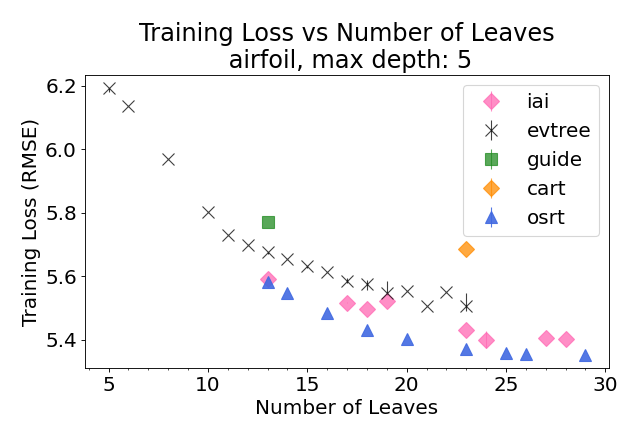
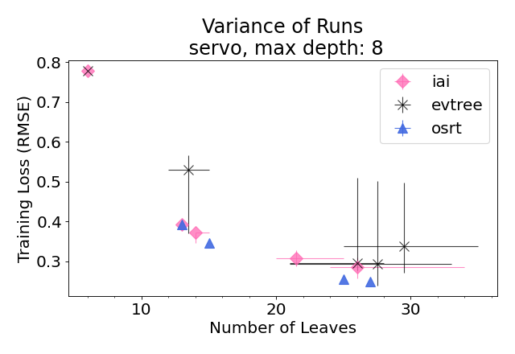
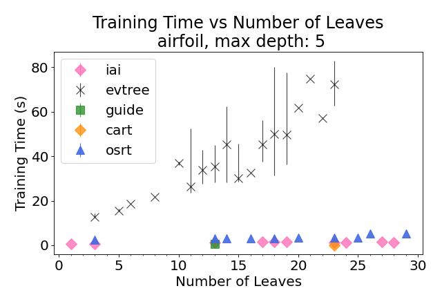
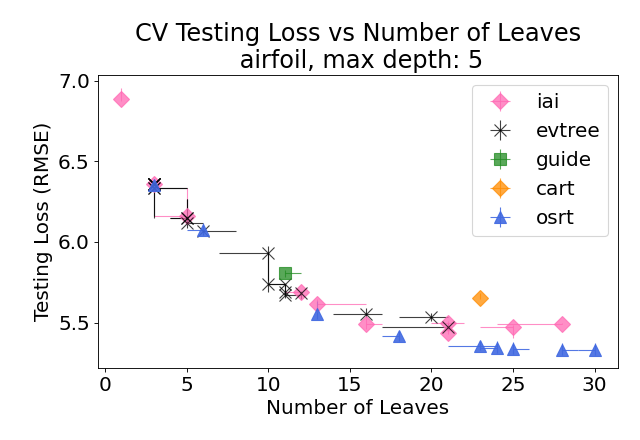
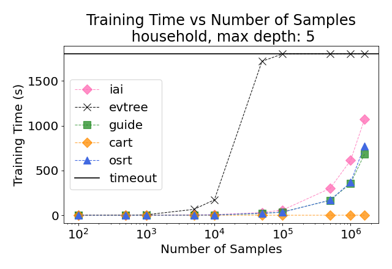

# regression-tree-benchmark
This is benchmarks of tree regressors: 
* OSRT: [Optimal Sparse Regression Tree](https://https://github.com/ruizhang1996/optimal-sparse-regression-tree-public)
* Evtree: [Evolutionary Classification and Regression Tree](https://cran.r-project.org/web/packages/evtree/vignettes/evtree.pdf)
* IAI: [Interpretable AI](https://www.interpretable.ai/products/optimal-trees/)
* GUIDE: [Generalized, Unbiased, Interaction Detection and Estimation](https://pages.stat.wisc.edu/~loh/guide.html)
* CART: [Classification and Regression Tree](https://scikit-learn.org/stable/modules/generated/sklearn.tree.DecisionTreeRegressor.html)


#### Usage:
```
python run.py cmd -d dataset1 dataset2 ...
```

#### Experiments and Examples:
+ Loss vs Sparsity: 
```
python run.py loss
```

+ Controllability
```
python run.py controllability
```

+ Time vs Sparsity
```
python run.py time
```

+ Cross-validation
```
python run.py cv
```

+ Scalability
```
python run.py scalability
```

